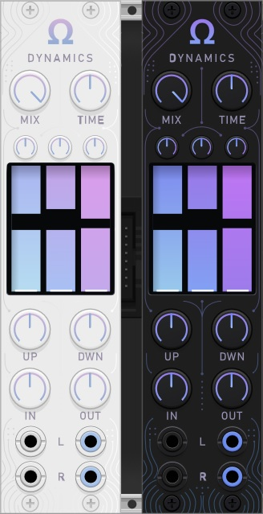
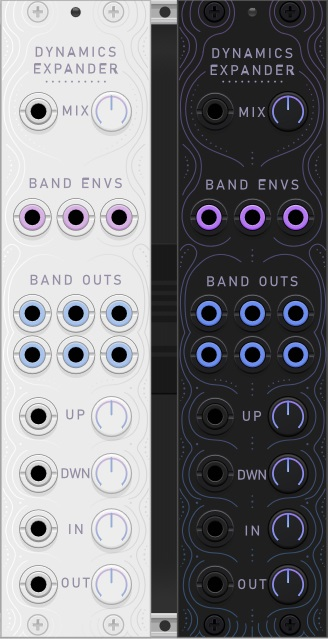

# Omega

Omega modules for VCV Rack 2 are copyright 2026 Ryan Voss and licensed under [GNU General Public License version 3 or later](LICENSE.md). Omega requires VCV Rack 2.4.0 or later.

<a id="modules"></a>
# Modules

Each module has dark and light panel themes.

* [Dynamics](#dynamics): OTT-style multiband upward/downward compressor.

* [Dynamics Expander](#dynamicsexpander): Expander module for Dynamics.

<a id="dynamics"></a>
## Dynamics



OTT-style multiband upward/downward compressor. This effect splits incoming audio into three spectral bands — lows, mids, and highs — and applies aggressive downward and upward compression separately to each band.

### Quick start

1. Connect audio to the **L** input.
2. Raise **UP** to bring up quiet details.
3. Raise **DWN** to control loud peaks.
4. Use **MIX** to blend the compressed signal with the dry signal.
5. Use **OUT** to compensate the final level.

### Controls

- **MIX**: Controls the mix amount between the dry (uncompressed) and wet (compressed) signals. 0% for full dry. 100% for full wet. Gains and compression are only applied to the wet signal. *Note: the dry signal still passes through the crossover filters, so there will be an inherent phase shift present at the crossover points even with 0% MIX.*
- **TIME**: Scales the attack and release times of the compressors simultaneously. From 10% to 1000%.
- **UP**: Sets the amount of upward compression, making the quieter parts of the signal sound louder. From 0% to 200%.
- **DWN**: Sets the amount of downward compression, taming the louder parts of the signal by making them quieter. From 0% to 200%.
- **IN**: The input gain applied to the incoming signal. From -24dB to +24dB.
- **OUT**: The output gain applied to the wet signal. From -24dB to +24dB.
- **L/R**: The stereo input and output ports. Audio outputs are colored blue. The left input must be connected to hear sound from the outputs. If only the left input is connected, the plugin will copy the mono signal to the right input. *Note: Dynamics applies stereo-linked compression, meaning the same amount of compression is applied to both L/R channels. This helps to preserve the stereo image of the signal.*
- **LCD Display**: Displays the behavior of each individual band (left to right: lows, mids, highs). The white horizontal bars indicate the VU levels of the incoming signal. The vertical gray bars indicate the VU levels of the outgoing signal after compression. The display is also interactive - the user can click and drag the bars up and down to change the band compression threshold. Right-clicking above/below the slider will disable the up/down compression for that band. Make-up gains for each band can be set using the small knobs above the LCD Display.
- **Context Menu**: Right-clicking anywhere on the front panel will cause the module's context menu to appear; allowing for further customization of the module. The user can set the band crossover points, hard-clip limits for the output, panel theme, and audio quality. Quality has two states: "Eco" and "High". "Eco" can be used for most scenarios and is very CPU-friendly. The "High" setting applies oversampling and anti-aliasing to the processing, but uses more CPU.

<a id="dynamicsexpander"></a>
## Dynamics Expander



Expander module for [Dynamics](#dynamics). This module, when placed to the right of Dynamics, adds CV modulation capability to the compressor's MIX, UP, DWN, IN, OUT parameters. It also provides stereo audio outputs for each band (Low / Mid / High), as well as CV outputs for each band's internal envelope (linear dB mapped to 0-10 V). The envelope range and polarity can be set in the module's context menu.

# Installation

Once accepted into the VCV Library, subscribe to the plugin from the VCV Library browser.

## Building from source

Omega is a VCV Rack 2 plugin. To build it from source, you need the VCV Rack 2 SDK and a working C++ build environment.

### Requirements

- Omega requires a CPU architecture supported by the VCV Rack 2 SDK.
- VCV Rack 2
- VCV Rack 2 SDK
- Git
- `make`
- A C++ compiler supported by the Rack SDK

You do **not** need to build VCV Rack itself from source. The Rack SDK is enough for building plugins.

Download the VCV Rack 2 SDK from https://vcvrack.com/downloads and extract it somewhere convenient. Make sure that `RACK_DIR` points to the folder that contains `plugin.mk`:

```bash
RACK_DIR=/path/to/Rack-SDK
```
Then change to the OmegaModules folder and run `make`:
```
make dist
```

## Support

Omega is free and open source.

If you find this plugin useful and would like to support its development, donations are appreciated:

[Support Omega via PayPal](https://www.paypal.com/ncp/payment/6GPSPGDWUQR74)
